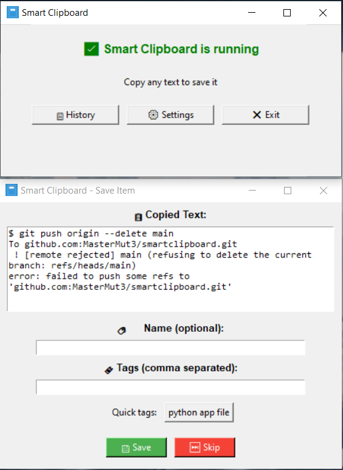
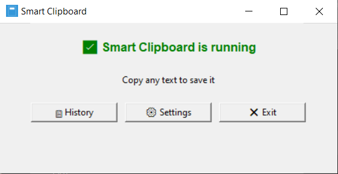
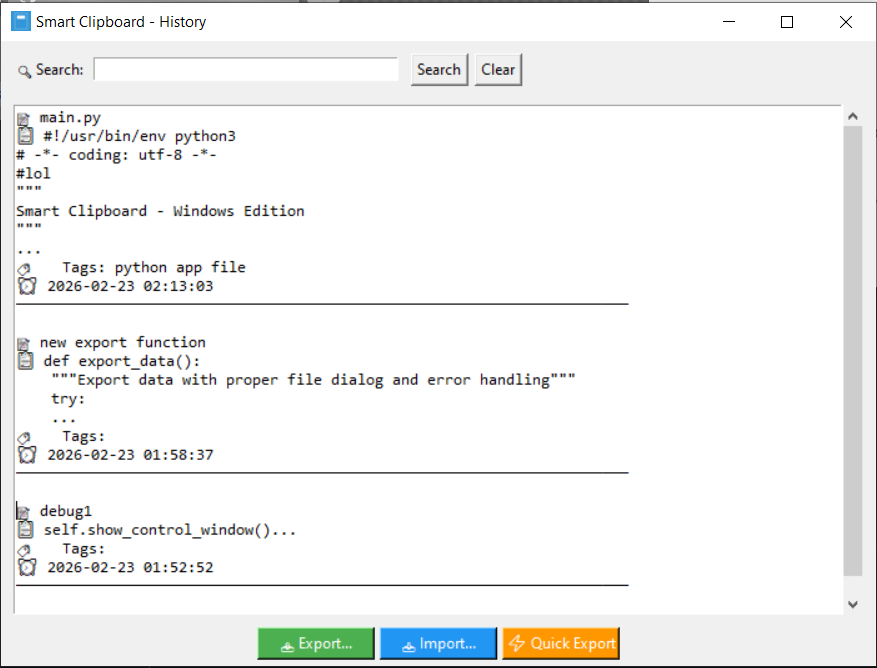

# 📋 Smart Clipboard

A powerful clipboard manager for Windows that automatically saves everything you copy with optional names and tags.



## ✨ Features

- **🔄 Real-time Monitoring** - Automatically detects text you copy (Ctrl+C)
- **🏷️ Smart Organization** - Add names and tags to saved items
- **🔍 Powerful Search** - Find anything in your clipboard history
- **💾 Export/Import** - Backup and restore your data
- **⚡ Quick Export** - One-click save to Desktop
- **🚀 Two Versions** - Installer and Portable available

## 📦 Downloads

| Version | File | Description |
|---------|------|-------------|
| 🏠 Installer | [SmartClipboard-Setup.exe](https://github.com/MasterMut3/smartclipboard/tree/platform/windows/installer) | Regular installation (adds to Start Menu) |
| 💾 Portable | [SmartClipboard-Portable.zip](https://github.com/MasterMut3/smartclipboard/blob/platform/windows/SmartClipboard-Portable-v1.0.zip) | No installation, run from anywhere |

## 🚀 Quick Start

### Installer Version
1. Download `SmartClipboard-Setup.exe`
2. Run the installer
3. Launch from Start Menu or Desktop shortcut
4. Start copying text - it will automatically save!

### Portable Version
1. Download `SmartClipboard-Portable.zip`
2. Extract to any folder (USB drive, Desktop, etc.)
3. Run `SmartClipboard-Portable.exe`
4. All data will be saved in the same folder

## 📖 How to Use

1. **Copy any text** (Ctrl+C anywhere)
2. **Name it** (optional) in the popup dialog
3. **Add tags** (comma-separated, optional)
4. **Access history** from system tray icon
5. **Search** through your saved items

## 🖼️ Screenshots

| Main Dialog | History Window |
|-------------|----------------|
|  |  |

## 🔧 System Requirements

- Windows 7, 8, 10, or 11
- 50MB free disk space
- No internet connection required

## 📁 Data Storage

### Installer Version
%USERPROFILE%.smart_clipboard\data.json
### Portable Version
[App Folder]\clipboard_data.json

## 🛠️ Building from Source

```bash
# Clone the repository
git clone https://github.com/yourusername/smart-clipboard.git
cd smart-clipboard

# Create virtual environment
python -m venv .venv
.venv\Scripts\activate

# Install dependencies
pip install -r requirements.txt

# Build both versions
build_portable.bat
build_installer.bat
```
##🤝 Contributing
Contributions are welcome! Please feel free to submit a Pull Request.

Fork the repository

Create your feature branch (git checkout -b feature/amazing-feature)

Commit your changes (git commit -m 'Add amazing feature')

Push to the branch (git push origin feature/amazing-feature)

Open a Pull Request

##📝 License
This project is licensed under the MIT License - see the LICENSE file for details.

##🙏 Acknowledgments
Thanks to all contributors

Built with Python and love ❤️

##📬 Contact
GitHub: @MasterMut3

Email: mastermute.html@gmail.com

Issues: GitHub Issues

##⭐ Support
If you find this useful, please give it a star on GitHub!
